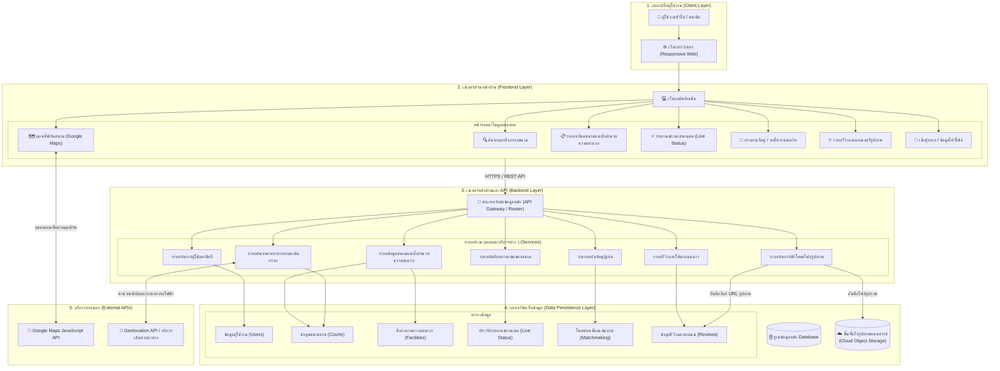
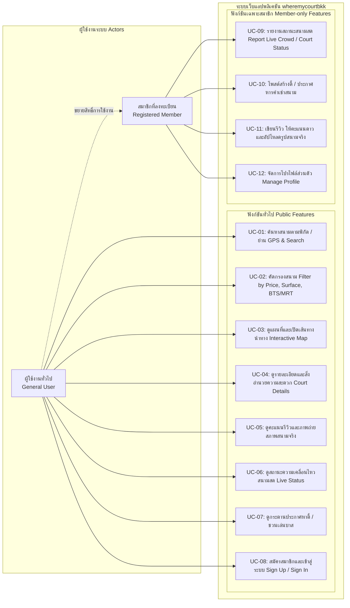

# รายงานโครงการ Phase 2: Initial Design and Prototype
**โครงการ:** เว็บแอปพลิเคชันค้นหาและคัดกรองสนามบาสเกตบอลในกรุงเทพมหานคร (wheremycourtbkk)

---

## รายชื่อสมาชิกกลุ่ม
1. นายจตุรภัทร วงษ์ชื่น รหัสนิสิต 68102010193
2. นายฐานพัฒน์ อังศุโภไคย รหัสนิสิต 68102010197
3. นายสุวิจักขณ์ วงค์น้อย รหัสนิสิต 68102010218
4. นายอคิราห์ ไทโย เลิศวิทยา รหัสนิสิต 68102010219

---

## 1. ข้อมูลเดิมจาก Phase 1 (Original Requirements)

### 1.1 Functional Requirements (FR)
-**FR1:** ระบบค้นหาพิกัดสนามตามตำแหน่งปัจจุบัน (GPS) และค้นหาตามย่าน/ทำเล

-**FR2:** ระบบคัดกรองตามราคา ประเภทสนาม เวลาเปิด-ปิด และระยะห่างรถไฟฟ้า BTS/MRT

-**FR3:** ระบบแสดงหมุดพิกัดบน Google Maps และนำทาง

-**FR4:** ระบบแสดงสิ่งอำนวยความสะดวก (ไฟ, แป้น, ที่จอดรถ, น้ำดื่ม, ห้องน้ำ)

-**FR5:** ระบบรายงานสถานะสด (Live Status)

-**FR6:** ระบบบอร์ดหาตี้และหารค่าคอร์ท

-**FR7:** ระบบรีวิวและอัปโหลดภาพสภาพสนาม

### 1.2 Non-Functional Requirements (NFR)
-**NFR1 (Performance):** หน้าเว็บและแผนที่ต้องโหลดแสดงผลเสร็จสิ้นภายใน 3 วินาที

-**NFR2 (Usability):** รองรับ Responsive Design บนมือถือ แท็บเล็ต และคอมพิวเตอร์

-**NFR3 (Reliability):** ใช้งานแผนที่ได้ต่อเนื่อง 99% ผ่าน Google Maps API

---

## 2. สิ่งที่เปลี่ยนแปลงจากรายงาน Phase 1 และเหตุผลที่เปลี่ยน

* **สิ่งที่เปลี่ยนแปลง:** 
  * []
* **เหตุผลที่เปลี่ยน:** 
  * []

---

## 3. Design Document

### 3.1 Architectural Design (High-Level Architecture)

### 3.2 Use Case Diagram

## 4. UI Design & Prototype Screenshots

### 4.1 Figma Prototype Link & Overview
**ลิงก์ Figma Design:** https://www.figma.com/design/V7rcTsqLeaMGApU4bt7l21/WhereMyCourtBKKFinal?node-id=21-6477&t=6iatY9JYgsdvJKOt-1

### 4.2 Website Screenshots
**หน้า 1:**

**หน้า 2:**

## 5. กระบวนการทำงาน (Process, Methods, and Tools ที่เพิ่มเติมจาก Phase 1)
**การติดตามสถานะงาน (Project Tracking):** ใช้ GitHub Projects ในรูปแบบ Kanban Board แบ่งสถานะงานเป็น Todo, In Progress, Done

**ความถี่ของการประชุม (Scrum Cadence):** จัดประชุม Standup ประจำสัปดาห์สัปดาห์ละ 1-2 ครั้ง ผ่าน Discord

**ข้อกำหนดการตั้งชื่อ Branch (Branching Convention):**

**รูปแบบ Commit Message (Commit Formatting):**

**เครื่องมือและการสื่อสาร (Communication Tools):**
-**Discord:** ใช้สำหรับการประชุมอัปเดตงาน ประชุม Retrospective และแชร์หน้าจอเขียนโค้ด
-**LINE Group**: ใช้สำหรับประสานงานและแจ้งเตือน

## 6. สรุปการประชุมทบทวนการทำงาน (Sprint Retrospective)
**ลิงก์วิดีโอ Retrospective (YouTube):**

### 6.1 สิ่งที่ทำได้ดี (What went well)

### 6.2 ปัญหาและอุปสรรคที่พบ (What could be improved)

### 6.3 แนวทางการปรับปรุงใน Sprint ถัดไป (Action Items)
